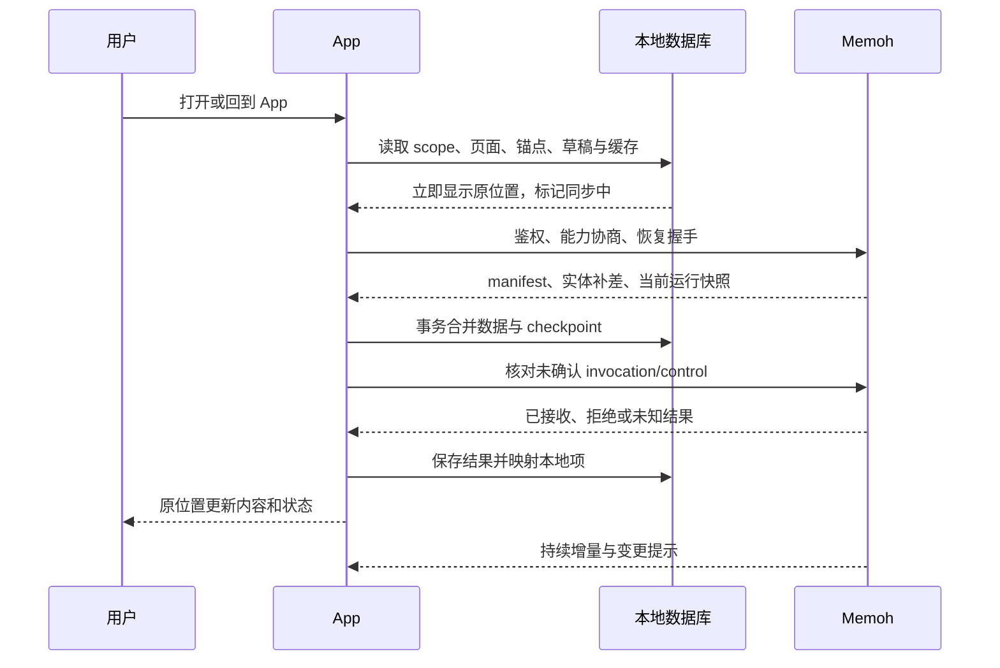

# 同步与恢复协议草案

日期：2026-09-12。状态：供客户端与 Memoh maintainer 讨论的协议要求，**新增字段、能力名、路由均为提案**，不能当成当前可调用 API。现状见 [仓库调查](02-upstream-investigation.md)。

## 正确性目标

服务端负责 Agent 执行与权威数据；手机负责本地副本、操作意图和用户阅读状态。客户端被暂停、断网或终止是正常输入，不是例外路径。

Android Doze / App Standby 会限制网络和后台执行，iOS 也会挂起后台应用。后台任务和推送只能增加更新机会，不能作为完整性的唯一保障。[Android 后台限制](https://developer.android.com/training/monitoring-device-state/doze-standby)、[Apple 后台策略](https://developer.apple.com/documentation/BackgroundTasks/choosing-background-strategies-for-your-app)。

建议共同承诺以下不变量：

1. 同一次操作重传不产生第二次准入；重试使用原 invocation/control ID。
2. 显示“已发送”意味着服务端确认持久化准入，不能只意味着 socket.send 成功。
3. 连接断开只改变客户端连接状态，不把服务端 run 直接改成 failed / completed。
4. 恢复后持久消息、修改/删除、当前 run、队列和待决策事项收敛到服务端事实。
5. checkpoint 不能超过客户端已可靠保存的数据；崩溃后允许重复接收，不允许跳过未落盘内容。
6. 页面回前台、获取快照和缓存刷新不重置阅读锚点、草稿、选中的 Session。
7. 已撤销权限的连接、缓存入口与待发送操作必须有明确处理；客户端过滤不能代替服务端授权。
8. “任务至多准入一次”不等于任意外部工具副作用 exactly-once。支付、发送消息等副作用仍由运行时与工具自己的幂等机制负责。

## 四组独立状态

| 状态对象 | 建议状态示例 | 用户含义 |
| --- | --- | --- |
| 连接 | offline / connecting / online / auth_required | 能否联系服务端 |
| 同步 | cached / reconciling / current / blocked | 当前显示的信息新鲜度 |
| 操作 | queued_locally / submitting / unknown / accepted / rejected | 这次发送或控制到底有没有被接收 |
| Run | 映射上游 running、waiting_decision、aborting、finishing、completed、aborted、errored、lost 等 | Agent 的实际执行状态 |

不把本地 queued_locally 当成服务端 follow-up queue。后者意味着服务端已接收并管理顺序，前者只在手机上。

App 不在线时可以显示“上次同步：运行中 · 3 分钟前”，不能继续显示毫无提示的实时绿灯。停止按钮进入“停止请求确认中”，待 control ack 与权威 run 状态核对后才显示结果。

## 身份与隔离

所有本地实体、请求队列、连接和通知路由至少包含：

```text
Scope = deployment_id + account_id + team_id
SessionKey = Scope + bot_id + session_id
RunKey = SessionKey + run_id
```

`deployment_id` 建议由服务端 discovery 提供稳定安装身份。旧服务器缺失时先使用客户端生成的 connection profile ID；URL 只是连接属性，不是跨账号通用身份。URL 改动、服务器迁移和恢复备份后的实例身份需由 maintainer 定义，不能自动合并不明来源数据。

现有默认 team_id 在每个自部署实例中相同，故不能省略 deployment_id。账号切换必须停止旧 scope 的订阅与 outbox worker；使用连接 generation 防止旧异步响应写入新 scope。

Team 下未来是否另有协作 Workspace，由正式 Cloud 契约确定。运行环境使用独立的 workspace_target_id / runtime_id。不要用一个 workspace_id 同时表示租户和容器。

## 两类同步通道

### 持久实体补差：保证离线完整性

建议建立有版本的 change feed，承载 Session 摘要、持久化 turn/message、run 终态、decision、队列和产物元数据的变更。只发当前用户有权读取的数据，并明确删除、编辑、重试替换历史尾部和权限撤销的语义。

它可以采用“持久化变更记录 + REST 分页拉取 + WS 提示有更新”，不要求先建设永久 token 事件存储，也不要求 Kafka 等额外基础设施。领域更新和对应 outbox/change 记录应在同一数据库事务内提交；异步通知丢失时，客户端仍能拉到变化。

提案中的不透明 `sync_cursor` 是持久变更 feed 的位置，与既有 runtime `{epoch, seq}` 完全不同。客户端不可自行比较、递增或猜测游标。服务端必须定义 scope、分页截止位置、保留期、授权变化、过期返回和重建路径。

权限过滤下，一个用户看不到全部事件，不能要求其持久 feed 序号逐个连续；用服务端返回的 next_cursor / has_more 判定翻页，不能因过滤导致数字缺口就误判丢包。

### 当前运行流：保证及时性

沿用现有 `runtime_subscribe` / `runtime_snapshot` / `runtime_delta` / `runtime_dropped`，以及 `{epoch, seq}`。

- 同 epoch 的重复 delta 丢弃；按现有协议检查连续位置。
- epoch 改变、缺口或 dropped 时重新获取快照；恢复期间不继续拼接不可信的 delta。
- 快照只替换对应实时投影，不删除整个本地历史，也不重建整个页面。
- 可以后续增加有上限的运行增量回放以降低带宽；没有回放仍应能用完整快照正确恢复。
- 永久持久历史与实时未完成内容的交接通过 run_id / turn_id 及版本边界完成，不能用文本相同推断。

## 历史与 live 的一致边界

目前 runtime 快照与 REST history 分离。需要解决如下竞态：客户端读取历史后任务完成，随后 runtime 快照已经不含这个 run，最终输出却没有进入客户端历史。

建议最小扩展是权威 session bootstrap / sync manifest，提供以下**逻辑信息**，具体 JSON 结构待定：

```text
session revision / history generation
history high-watermark 与分页快照 token
current run snapshot（或可获取它的引用）
已提交到历史的 run/turn 关联与 committed-through 边界
pending decisions 与 queue 的版本
后续持久变更 cursor
```

服务端必须定义这个 manifest 的一致性保证。可通过持久 ledger 和历史事务边界，加 live snapshot 的版本校验/重读实现；不能只是独立查几张表后拼成“原子快照”。不要求把整个长历史和所有 token 都塞进一个巨大响应。

一种可实现的恢复握手：先建立可缓冲订阅，获取明确 high-watermark 的 manifest 和所需历史页，再应用该边界之后的事件。边界前的重复事件按身份/版本去重；缓冲溢出重新做握手。若 live store 与持久库读取之间版本不兼容，服务端返回需重试或客户端重读 manifest，不能靠请求时间先后来猜测一致性。

同步提交时，在 SQLite 的同一事务中更新实体、删除标记和对应 durable checkpoint。实时投影 checkpoint 若也持久化，必须与其投影一起保存。数据库事务提交后再向 UI 发布变更。

如果 cursor 过期，重建的是该 scope 的同步副本：分页建立新 generation，保留本地草稿、outbox 和阅读状态；新基线可用后切换。**不能执行“清空数据库 → 刷新首页”作为恢复流程。**

删除和编辑需保留 tombstone 或等价同步语义；按时间戳 `updated_since` 不足以可靠覆盖并发、同毫秒写入和删除。若读权限已撤销，返回明确范围失效信号并按策略清理对应缓存；离线设备只能在再次联系服务端后获知撤权，不能承诺即时远程擦除。

## Outbox 与不确定结果

发送流程建议：

1. 用户按发送时，先在本地事务中保存不可变的规范化输入、scope、invocation_id、附件引用与本地显示项。保存失败则不提示“等待发送成功”。
2. 网络可用且 scope 已鉴权后提交。相同操作持续使用同一 ID 与相同规范化 payload；修改内容构成新意图。
3. 收到持久准入 ACK，事务保存 invocation → session/run/turn 映射，再将本地状态改为 accepted。
4. 超时或断线先进入 unknown；查询已有结果，或按服务端声明的幂等期限用原 ID 重传。
5. 收到明确拒绝才显示 rejected；网络超时不能直接等同服务端拒绝。

已有 ledger 可以扩展对外操作结果查询，优先复用，而非增加第二套去重表。操作查询必须绑定调用者、Team 和资源权限。

首次发消息如果 session_id 尚不存在，需定义幂等建 Session 或原子 create-and-submit 的映射；现有同 session 幂等并不自动覆盖“创建成功但响应丢失”。这是首版协议验收重点。

服务器应声明幂等记录的有效期限与过期行为；记录过期后不能静默用新 ID 自动发起一个可能已经完成的任务。界面显示“暂时无法确认发送结果”，让用户查看历史后明确决定是否重新发送。

控制操作同样保存 control_id、run_id、decision_id。重启后先核对目标是否仍有效：已经被其他设备处理的审批显示最终决定，过期的回答不能应用到新的问题。待确认的已发送控制可以查询/按契约重试；新的离线审批或停止建议等同步后明确操作，避免旧意图延迟生效。

已有 steer/follow-up queue 与手机 outbox 分离；服务端队列的取消、重排、提升需补充版本/冲突语义。不能假定所有现有 HTTP mutation 都已经支持持久幂等。

附件先复制到 App 可管理的持久目录，上传完成后保存服务端 asset 引用，再提交引用；不能在重启后依赖失效的临时 URI。可恢复上传、content hash 校验、孤儿清理与大小上限作为后续协议项，先实现可靠的小附件链路。

## 回前台与冷启动时序



每个 scope 一个同步协调器，禁止路由页面各自创建重连循环。回前台时主动确认实际可达性；系统显示有网络只是一条提示，不能证明 Memoh 能访问。使用退避加随机抖动，单次刷新锁、心跳超时与连接 generation；鉴权失效进入登录处理，不能无限刷重连。

页面离开仅降低正文订阅优先级，不取消服务端 run。进程可能在任意时刻被终止，因此 outbox 必须在发送前持久化，草稿与锚点持续合适地保存，不能只依赖 onBackground 回调补存。

## 多 Session 与推送

建议一个 Team 范围的轻量摘要/待处理 feed，当前聊天单独订阅正文；20 个运行会话无需 20 套富文本树。现有按 Bot 的 SSE 可做过渡，第一版允许少量按 Bot 连接，但跨 Bot 聚合能力应作为上游协议扩展。

推送承载“某事项发生了”的提示与可鉴权的资源定位。打开通知后先核验 scope 和权限，再同步最终状态；不能把推送 payload 当权威数据库更新。通知重复、乱序、延迟、关闭权限时，前台恢复仍须完整。

自部署推送需要明确谁运营 APNs/FCM/其他网关：公开 App 的凭据通常应由受控的 App 推送服务管理，不能分发私钥给每个部署。可以提供自部署服务向可选 relay 投递最小通知的模式，也可以暂时只做 App 内待处理。部署的网络地址不必公开给 relay；是否允许外部通知元数据经过 relay 由产品设置说明。

无 GMS Android 或特定网络环境的可达性仍待用户设备确认。不能用“有 FCM SDK”推断可靠送达；也不为维持聊天 socket 常驻而默认要求前台服务和忽略省电策略。

## 鉴权、能力协商与兼容

建议 discovery 返回协议版本、deployment 身份、认证方式、支持的同步/结果查询/聚合/推送能力，以及各资源可执行操作。能力描述仅帮助客户端展示，服务端每次读写、订阅与敏感控制仍独立授权。

现有 access token refresh 依赖有效 JWT；长时间休眠可能超过有效期。建议扩展可撤销的设备会话、refresh token 轮换和设备管理，或明确要求重新登录；不要假设过期 access token 可以无限续期。客户端单次并发刷新，凭据按 scope 存系统安全存储，日志不记录 token。

WS 在原生传输允许时用 Authorization header；若需 ticket，使用短时受限 ticket。不能在没有协议支持时擅自改变现有鉴权。对自部署 HTTPS、私有 CA、反向代理子路径和地址变更给出正常接入路径；不以全局关闭 TLS 校验解决连接问题。

建议兼容分两档：

- 当前服务器：现有快照 + 历史刷新，能力受限时明确降级；不承诺尚无协议保障的完整长离线补差。
- 移动协议服务器：提供本草案定稿后的完整保证，首版可靠体验内测以此为验收对象。

当前最低支持 Memoh v0.17.0（2026-09-28 决定，可能随协议合入上调；以 `contracts/README.md` 为准）。收到未知字段可忽略；收到无法理解且会改变状态语义的事件应触发重新同步或提示升级，不能静默标记已经同步。

## 可交给实现者的验收矩阵

| 故障注入 | 必须观察到的结果 |
| --- | --- |
| 服务端接收后丢弃 ACK | 同 ID 重试，服务端只有一个 run/turn；本地只有一个对应发送项 |
| 第一次建 Session 成功但丢响应 | 恢复同一 Session，不产生第二个聊天 |
| 输出中网络切换/断网 | UI 保留已有内容；重新同步后无缺字、重复或旧 delta 污染 |
| App 在后台被系统终止 | 冷启动恢复草稿、outbox、选中聊天与锚点；服务端任务不受影响 |
| 用户主动强制停止 App | 区别于普通进程回收，允许通知暂停；下次手动打开仍正确同步 |
| 离线时任务完成并产生后续消息 | 历史补齐，当前 run / 完成状态收敛；不是只拿最后一条消息 |
| 离线时编辑、重试、删历史 | 旧记录按 revision/tombstone 正确替换，保留有效阅读位置 |
| 快照与最终历史提交竞态 | 最终结果不消失、不重复，明确 committed-through 边界 |
| runtime 重启、epoch 改变 | 丢弃旧 epoch 流，接受新快照；必要时显示 lost，不自动宣告成功 |
| cursor 超出保留期 | 分页重建副本，草稿/outbox/锚点保留 |
| 同一审批由另一设备先处理 | 显示已处理，旧响应不作用到新 decision |
| 切账号/Team 时旧请求晚到 | 不写入新 scope，也不在新账号下发送旧 outbox |
| 权限撤销 | 后续请求和订阅不能泄露资源；在线客户端清理受影响入口 |
| 滚动读历史时新增 token/图片尺寸变化 | 保持 turn/block 语义锚点；只显示新内容提示 |
| 推送重复、乱序、关闭或不可达 | 待处理最终状态以同步为准，前台完整性不受影响 |
| 20 会话、一个可见正文 | 摘要准确、正文订阅受控、操作当前聊天不卡顿 |

实现时复用上游现有 Session Runtime 黑盒验收拓扑，在用户提供的独立 Linux 测试部署扩展契约用例；服务端 kill / 数据库故障只针对测试环境。再用 Android 真机补充进程终止、键盘、滚动与通知测试。当前仅制定计划，未执行任何故障注入。
